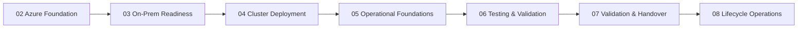

# Deployment Overview

The Azure Local Toolkit follows a structured deployment lifecycle organized into stages 02 through 08. Each stage has its own set of PowerShell scripts in `scripts/deploy/`.

!!! note "Stage 01 Skipped"
    Stage 01 was environment-specific CI/CD infrastructure and is not included in this toolkit.

## Stage Progression

## Common Modules

The `scripts/common/` directory contains shared modules used across all stages:

- **Config Loader** — Reads `infrastructure.yml` and resolves variable references
- **Key Vault Resolver** — Retrieves secrets from Azure Key Vault at runtime
- **Logging** — Standardized output formatting and log file management
