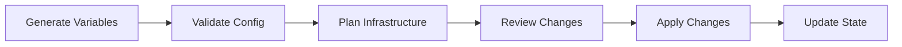

# Infrastructure Standards

> **Canonical reference:** [Infrastructure Standards (full)](https://azurelocal.cloud/standards/infrastructure/)  
> **Applies to:** All AzureLocal repositories  
> **Last Updated:** 2026-03-17

---

## Overview

Standards for Infrastructure as Code (IaC), Terraform state management, and deployment processes for the Azure Local Platform Toolkit.

---

## Infrastructure Pipeline

---

## State Management

| Principle | Rule |
|-----------|------|
| Remote state | Store Terraform state in Azure Storage Account |
| State locking | Enable locking during all operations |
| Backup | Regular state file backups before destructive operations |
| Naming | `toolkit-<env>.tfstate` (e.g., `toolkit-prod.tfstate`) |

---

## IaC Tool Parity

All tools must produce **identical infrastructure** when given the same configuration values:

| Tool | Primary Format | State Management |
|------|---------------|-----------------|
| Terraform | `.tf` / `.tfvars` | Remote state in Azure Storage |
| Bicep | `.bicep` / `.bicepparam` | ARM deployment history |
| ARM | `.json` | ARM deployment history |
| PowerShell | `.ps1` | Config-driven, logged |
| Ansible | `.yml` | Inventory-based |

---

## Toolkit-Specific Infrastructure

| Convention | Rule |
|-----------|------|
| Platform scope | Manages the full Azure Local infrastructure lifecycle |
| Config source | `config/infrastructure.yml` (13-section master config, single source of truth) |
| Parameter generation | `config/Generate-AzureLocal-Parameters.ps1` derives tool-specific params |
| Schema validation | 800-line `config/schema/variables.schema.json` enforces structure on every PR |

### Deployment Stages

| Stage | Scope |
|-------|-------|
| Stage 02: Azure Foundation | Resource groups, networking, Key Vault, storage |
| Stage 03: On-Prem Readiness | AD prep, OU structure, DNS, certificates |
| Stage 04: Cluster Deployment | Azure Local cluster registration and deployment |
| Stage 05: Operational Foundations | Monitoring, backup, update management |
| Stage 06: Testing & Validation | Pester tests, connectivity validation |
| Stage 07: Validation & Handover | Final checks, documentation, handover |
| Stage 08: Lifecycle Operations | Day-2 operations, patching, scaling |

---

## Related Standards

- [Infrastructure Generation & Deployment Process](https://azurelocal.cloud/standards/infrastructure/infrastructure-generation-deployment-process)
- [State Management](https://azurelocal.cloud/standards/infrastructure/state-management)
- [Solution Development Standard](solutions.md)
- [Variable Standards](variables.md)
- [Automation Interoperability](automation.md)
